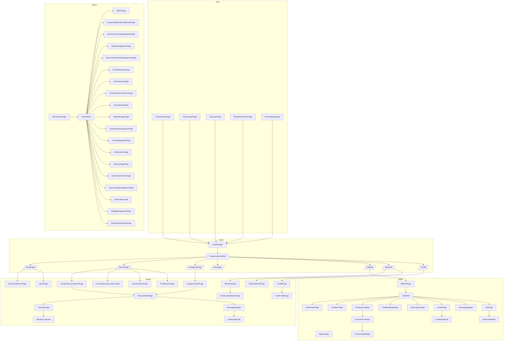

## Whole App Flows (Mermaid)

Note: Information-only platform. No orders/cart/checkout. Reviews open to any signed-up user.

```mermaid
flowchart TD

  subgraph Auth
    A1[FirebaseAuthPage]
    A2[PhoneLoginPage]
    A3[OtpLoginPage]
    A4[SimplePhoneAuthPage]
    A5[PhoneSignupPage]
  end

  subgraph Shell
    S1[AuthWrapper]
    S2[ResponsiveScaffold]
    R1[/ HomePage /]
    R2[/ SearchPage /]
    R3[/ CategoriesPage /]
    R4[/ Messages /]
    R5[/ SellHub /]
    R6[/ StateInfo /]
    R7[/ Profile /]
  end

  %% Buyer
  subgraph Buyer
    B1[EnhancedSearchPage]
    B2[ComprehensiveSearchPage]
    B3[SearchHistoryPage]
    B4[CategoryDetailPage]
    B5[ProductDetailPage]
    B6[ProductsListPage]
    B7[ReviewsPage]
    B8[ReviewComposer]
    B9[MessagingPages]
    B10[LeadDetailPage]
    B11[ComprehensiveLocationPage]
    B12[StateInfoPage]
    B13[EnhancedStateInfoPage]
    B14[CleanStateInfoPage]
    B15[AboutPage]
    B16[ProfilePage]
    B17[UserProfilePage]
  end

  %% Seller
  subgraph Seller
    SL1[SignupPage]
    SL2[SellHubPage]
    SL3[HubShell]
    SL4[DashboardPage]
    SL5[AnalyticsPage]
    SL6[ProductsListPage]
    SL7[ProductFormPage]
    SL8[ProductDetailPage]
    SL9[ProfileSettingsPage]
    SL10[SubscriptionPage]
    SL11[LeadsPage]
    SL12[LeadDetailPage]
    SL13[MessagingPages]
    SL14[AdsPage]
    SL15[AdsCreatePage]
  end

  %% Admin
  subgraph Admin
    AD1[AdminLoginPage]
    AD2[AdminShell]
    AD3[RBACPage]
    AD4[EnhancedRBACManagementPage]
    AD5[EnhancedUsersManagementPage]
    AD6[SellerManagementPage]
    AD7[EnhancedProductsManagementPage]
    AD8[ProductDesignsPage]
    AD9[HeroSectionsPage]
    AD10[EnhancedHeroSectionsPage]
    AD11[HeroSectionEditor]
    AD12[MediaStoragePage]
    AD13[CategoriesManagementPage]
    AD14[KYCManagementPage]
    AD15[NotificationsPage]
    AD16[FeatureFlagsPage]
    AD17[SystemOperationsPage]
    AD18[SubscriptionManagementPage]
    AD19[SubscriptionsTab]
    AD20[BillingManagementPage]
    AD21[AnalyticsDashboardPage]
  end

  %% Auth to Shell
  A1 --> S1
  A2 --> S1
  A3 --> S1
  A4 --> S1
  A5 --> S1
  S1 --> S2

  %% Shell navigation tabs
  S2 --> R1
  S2 --> R2
  S2 --> R3
  S2 --> R4
  S2 --> R5
  S2 --> R6
  S2 --> R7

  %% Buyer flows
  R1 --> B1
  R2 --> B2
  B2 --> B5
  R3 --> B4
  B4 --> B5
  B5 --> B7
  B7 --> B8
  B5 --> B9
  B9 --> B10
  R6 --> B12
  B12 --> B13
  R2 --> B11
  R1 --> B15
  R7 --> B16
  B16 --> B17
  R2 --> B3
  R2 --> B6
  R6 --> B14

  %% Seller flows
  R5 --> SL2
  SL2 --> SL3
  SL3 --> SL4
  SL3 --> SL5
  SL3 --> SL6
  SL6 --> SL7
  SL7 --> SL8
  SL3 --> SL9
  SL3 --> SL10
  SL3 --> SL11
  SL11 --> SL12
  SL3 --> SL13
  SL3 --> SL14
  SL14 --> SL15

  %% Admin flows
  AD1 --> AD2
  AD2 --> AD3
  AD2 --> AD4
  AD2 --> AD5
  AD2 --> AD6
  AD2 --> AD7
  AD2 --> AD8
  AD2 --> AD9
  AD2 --> AD10
  AD2 --> AD11
  AD2 --> AD12
  AD2 --> AD13
  AD2 --> AD14
  AD2 --> AD15
  AD2 --> AD16
  AD2 --> AD17
  AD2 --> AD18
  AD2 --> AD19
  AD2 --> AD20
  AD2 --> AD21
```

